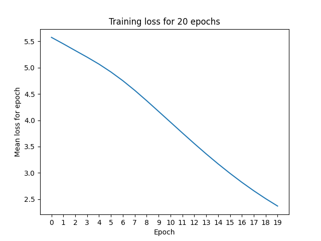
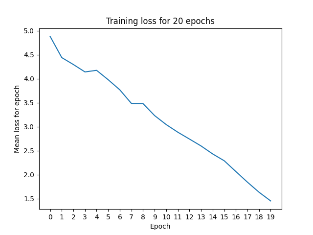

# Thai and English OCR 

This repository details my solution for assignment 1 of LT2926 at the University of Gothenburg (Machine learning for statistical NLP: advanced), building a system for Thai and English OCR. 

## Instructions for use 

Tl;dr if you want to run all the experiments required for this assignment, run `bash /home/gusandmich@GU.GU.SE/assignment_1/runs/do_all_runs.sh`. **This will overwrite all existing runs in that folder.**

Otherwise read below for instructions on how to use the individual scripts. 

### (Optional) Create the conda environment 

While waiting for the main server environment to be set up with the packages I needed, I set up a Conda environment with the necessary packages. You can install and use it as below:

```sh
conda env create -f setup_files/environment.yml --prefix /scratch/gusandmich/
conda activate /scratch/gusandmich/assignment_1_scratch/
``` 

Note I had to put it in `/scratch/gusandmich` rather than `/home/gusandmich` because `/home` is much too slow; loading all the packages from disk took too long when the Conda env lived there. 

### Generate training data

The [training data generation script](./assignment_code/generate_training_data.py) allows setting the languages, dpis and styles of generated data; as well as the train/test/validation split. 

For example, to generate a dataset of normal Thai and English text at 300 DPI, with 70% of data for train and 15% for validation and test respectively:

```sh
python3 assignment_code/generate_training_data.py
    --language Thai --language English # Default: all languages
    --dpi 300 # Default: all DPIs
    --style normal # Default: all styles
    --train_proportion 0.7 --validation_proportion 0.15 --test_proportion 0.15 # Default: 60/20/20
    --output_path some_training_data_folder
    --logging_path results.log
```

This will create three files in `some_training_data_folder`: `training_set.txt`, `validation_set.txt`, `testing_set.txt`; and log the size and path of each dataset to `result.log`.

### Train a model

Use the [model training script](./assignment_code/train_model.py) to train a model on a given training set, and optionally report performance on a validation set:

```sh
python3 assignment_code/train_model.py 
    --train-data some_training_data_folder/training_set.txt 
    --validation-data some_training_data_folder/validation_set.txt 
    --save_dir some_results_folder
    --logging_path results.log
    --batches 1 # Default 1
    --epochs 10 # Default 100
```

This will save:
- A training log to `results.log`, giving performance on train, test, and (optionally) validation.
- A plot of the per-epoch training loss (average across the batches in the epoch) to `some_results_folder/training_log.png`.
- The trained model to `some_results_folder/model.pth`. 


### Evaluate a trained model

Use the [model evaluation script](./assignment_code/evaluate_model.py) to evaluate a model on a given testing set:

```sh
python3 assignment_code/evaluate_model.py 
    --test-data some_training_data_foldertesting_set.txt 
    --model_path some_results_folder/model.pth 
    --logging_path results.log
```

This will log the results of model evaluation (precision, recall, F1, accuracy) to `results.log`. 

## Comments on challenges / decisions
### Generating data
I generate the train/test/val datasets by writing a file in the format:

```
language,dpi,style,class_index,image_path
Thai,200,bold,199,/scratch/lt2326-2926-h24/ThaiOCR/ThaiOCR-TrainigSet/Thai/199/200/bold/KKTS212_200_31_20_199.bmp
```

This means the dataset definition uses up very little space and does not require copying any images around. 

### Image format
The provided images are in BMP, so we can't load them with [decode_image](https://pytorch.org/vision/main/generated/torchvision.io.decode_image.html#torchvision.io.decode_image) (BMP is not one of the supported formats). Instead, I use PIL to load the image and then convert it to a tensor. 

All the images come in slightly different shapes, even in the same DPI, which makes training tricky because the model should (generally) expect to receive everything in the same input size. I dealt with this by [resizing all images](https://pytorch.org/vision/main/generated/torchvision.transforms.Resize.html), regardless of DPI, to 64x64 images. 

### Architecture
I chose to use [LeNet 5](https://yann.lecun.com/exdb/publis/pdf/lecun-01a.pdf) as the architecture for this task.

The model outputs a vector that's equivalent in length to the number of classes: `output[i]` will get the probability of class `i`, where `i` is the numerical class assignment defined in [any of the training dataset descriptions](/scratch/lt2326-2926-h24/ThaiOCR/ThaiOCR-TrainigSet/English/20110202-List-Code-Character-OCR-Training-Database.txt). The most probable class can then by chosen by returning the highest-probability index.  

The output is *not* softmaxed - I'd initially applied a softmax but the PyTorch CrossEntropyLoss applies softmax as part of the loss, so doing so is unneeded. You could softmax the output of the model after it returns its predictions if you want to have a probability distribution on the output classes. 

## Experiment results

I ran all experiments with a batch size of 10 for 20 epochs. I chose these parameters arbitrarily. If I had more time I would have liked to do be more smart about this e.g. do some experiments to explore the impact of batch size on training performance, or include a smarter stopping criterion with an upper bound on the number of training epochs.

### Overview
Epochs too low. Lots of space left for loss to reduce.  

Performs best when train and test datasets come from the same distribution, as you would expect. 

Training on wide distribution performs fairly poorly. Would need to increase epochs by a lot to get a better model, because the loss does seem to be decreasing. 

Some of the performances are suspiciously low, wondering if there's a bug in the evaluation. Thai normal text 400 dpi - training results about half of testing results. Thai bold way too low. 

The biggest training... seems to not train at all. Possible issues? Loss jumps around a lot. Could use a different optimizer. Larger batch size. Maybe didn't shuffle the data? -> indeed did not shuffle the data, found bug in training data generation code. Added shuffle as argument to the dataset loader so hopefully will help train a better model for the bonus question.

### Train on Thai normal text, 200dpi, test on Thai normal text, 200dpi

| Section | Dataset size | 
| --- | --- | 
| Train | 16220 | 
| Validate | 5356 |
| Test | 5654 | 

Metric | Train | Validation | Test |  
---|---|---|---|
Precision | 37.926% | 37.579% | 38.342% | 
Recall | 44.320% | 41.775% | 42.691% | 
F1 | 33.097% | 32.411% | 33.257% | 
Accuracy | 39.051% | 38.610% | 39.563% | 

Training loss:



### Train on Thai normal text, 400dpi, test on Thai normal text, 200dpi

| Section | Dataset size | 
| --- | --- | 
| Train | 21606 | 
| Validate | 5478 |
| Test | 27230 | 

Metric | Train | Validation | Test |  
---|---|---|---|
Precision | 32.696% | 32.068% | 29.360%
Recall | 34.865% | 33.611% | 32.801%
F1 | 26.000% | 25.506% | 22.793%
Accuracy | 33.741% | 33.060% | 30.213%

Training loss:


### Train on Thai normal text, 400dpi, test on Thai bold text, 400dpi

| Section | Dataset size | 
| --- | --- | 
| Train | 21606 | 
| Validate | 5478 |
| Test | 27145 | 

Metric | Train | Validation | Test |  
---|---|---|---|
Precision | 14.565% | 14.065% | 11.971%
Recall | 11.070% | 10.709% | 11.032%
F1 | 8.236% | 7.847%  | 6.962%
Accuracy | 15.176% | 14.640% | 12.441%

Training loss:


### Train on Thai bold text, test on Thai normal text

| Section | Dataset size | 
| --- | --- | 
| Train | 21752 | 
| Validate | 5513 |
| Test | 27230 | 

Metric | Train | Validation | Test |  
---|---|---|---|
Precision | 9.490% | 9.468% | 7.267%
Recall | 5.430% | 4.459% | 3.772%
F1 | 3.901% | 3.936% | 3.193%
Accuracy | 9.788% | 9.759% | 7.514%


Training loss:


### Train on all Thai styles, test on all Thai styles

| Section | Dataset size | 
| --- | --- | 
| Train | 64922 | 
| Validate | 22624 |
| Test | 21442 | 

Metric | Train | Validation | Test |  
---|---|---|---|
Precision | 2.674%  | 2.581% | 2.698% 
Recall | 0.200%  | 0.184% | 0.203% 
F1 | 0.355%  | 0.329% | 0.359% 
Accuracy | 2.786%  | 2.687% | 2.812% 

Training loss:



### Train on Thai and English normal text jointly, test on Thai and English normal text jointly

Metric | Train | Validation | Test |  
---|---|---|---|
Precision | 8.952% | 8.951% | 8.906% | 
Recall | 3.907% | 2.774% | 4.751% | 
F1 | 3.288% | 3.143% | 3.340% | 
Accuracy | 9.229% | 9.232% | 9.186% | 

Training loss:


### Train on all Thai and English styles jointly (200dpi), test on all Thai and English styles jointly

| Section | Dataset size | 
| --- | --- | 
| Train | 64922 | 
| Validate | 21442 |
| Test | 22624 | 

Metric | Train | Validation | Test |  
---|---|---|---|
Precision | 0.662% | 0.662% | 0.662%
Recall | 0.005% | 0.005% | 0.005%
F1 | 0.009% | 0.009% | 0.009%
Accuracy | 0.690% | 0.690% | 0.690%

Training loss:


