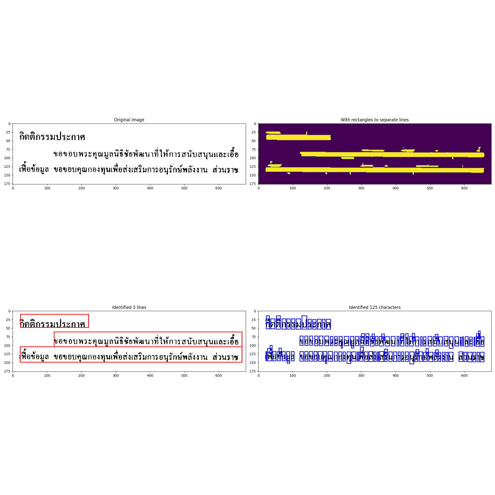
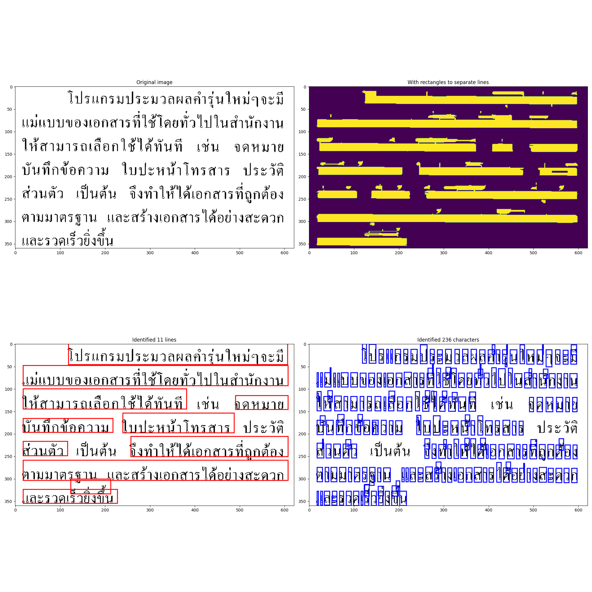
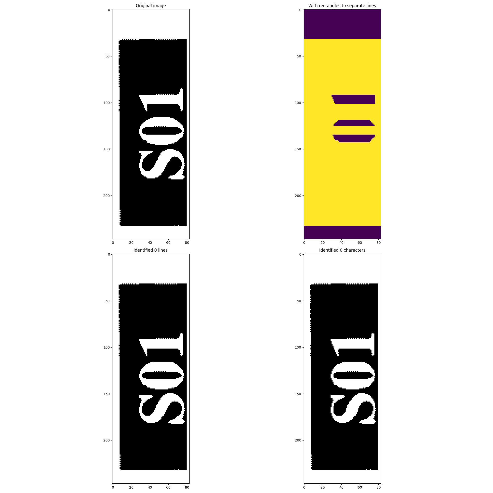
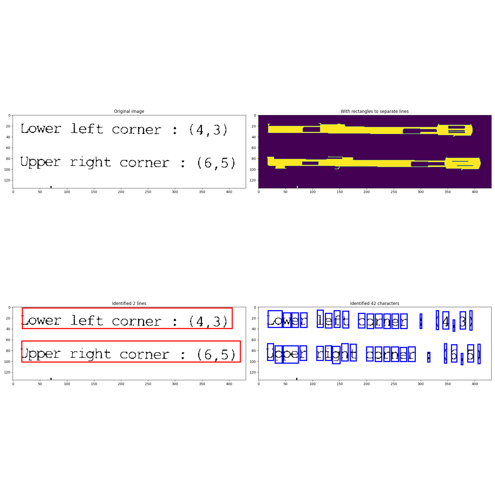

# Bonus question

I have implemented a partially-working pipeline to extract text from the whole-page scans and classify it on a character-level with a trained model. The character segmentation works well, but character prediction does not. I suspect the model is not generalizing to new data very well. 

The limitations are: 
- I have only run this on the 200dpi Book and Journal data - I did not look at the 300dpi data. 
- The labels provided in the training data do not correctly map to the provided images, making evaluation difficult. 
- I have only qualitatively assessed performance by looking at a sample of images, and have not assessed performance overall, because of issues with labelling and observed poor predictive performance. 
- The methodology to extract individual characters from pages in order does not work all of the time and I decided it would be too much time to get working reliably.

In the directory `/scratch/gusandmich/assignment_1_bonus_q` I have saved the outputs of running this pipeline on the 200dpi Book and 200dpi Journal datasets. In each of these directories, test images segmented into characters are in the folder `images`, predicted and actual texts for each test image are in the folder `output`. Trained model artefacts are in `/home/gusandmich@GU.GU.SE/assignment_1_run_results/runs/bonus_task`. 

## Understanding the task

The dataset here is whole *pages* rather than individual characters. The task is now twofold:
- Extract individual words or characters from the pages
- Run OCR to convert those words/characters into readable form

## Overview of approach

My approach is as follows:
- Segment the text into individual lines using OpenCV, and order them in reading order (top-to-bottom).
- Identify the characters in each of these lines using OpenCV, and order them in reading order (left-to-right).
- Train a model on the entire training dataset - Thai, English, Numeric, and Special characters. 
- Run the model each identified character to predict the class of that character. Its class is the most likely class predicted by the model. 
- Concatenate the predicted characters for each file (ordered top-to-bottom by row then left-to-right within each row) to get the final predicted text for the file.

## Detail of approach
In this section I go into detail on each of the steps of my approach:
1. Extract the characters from each page.
2. Train a character-level model on the entire training dataset.
3. Use the output of steps (1) and (2) to predict the text for the image.

### Extracting characters from each page
#### Approach

The testing data provides information about how to split each full page into labelled 'zones' of text. I use PIL to load the given images and split them into these zones (called segments in the code) by using the PIL `crop` utility. My implementation of this is in `read_segment_list` and `Segment.get_image_of_segment` in `bonus_task.py`. 

I do this process on the black-and-white images, rather than the grayscale images. The zones provided for each image are for the grayscale files, but I found they also worked well for the black-and-white images. Going straight for the black-and-white images means we don't need to do any thresholding to make the characters clearer and closer to the training set - someone's already done it for me! 

I follow a two-step approach to extract characters from the page segment. First, segment the zone into lines of text; then extract characters from each line. This is necessary because with the naive approach (running character segmentation over all the data) it is difficult to then order the characters in reading order (top-to-bottom, right-to-left). With this approach you can order the rows by y-coordinate to get the top-to-bottom reading order, then order the characters within each row by x-coordinate to get the left-to-right reading order.

To extract the rows, I use OpenCV's `morphologyEx` to threshold out the rows. I then run `findContours` to identify the bounding boxes of those rows. I spent some time exploring appropriate settings for this and settled on a kernel size of `(30, 1)` for the morphology kernel and some custom logic to select appropriately-sized bounding boxes. This is the first part of `get_characters_from_image` in `bonus_task.py`. This generally works ok, but struggles with text on unusual backgrounds or in unusual formats (e.g. if it is not text in paragraph form). 

For each row, I then run OpenCV's `findContours` to identify individual characters. Again I spent some time experimenting with the settings here and settled on only choosing boxes of sufficient height and width (but not too large, so as not to capture non-letter elements), with a bit of flex at the top and bottom to make sure the full letter was captured.  

I've included some examples below of how this pipeline works on example images. Counter-clockwise from the top-left, the steps demonstrate: the original image, applying `morphologyEx` to threshold the rows, applying `findContours` to identify the individual rows, and applying `findContours` to identify individual characters. 

Pipeline works well, rows and characters appear correctly segmented:


Pipeline works okay, some issues with row segmentation mean that some characters are missed. I suspect this is because I specify the rows have to be quite long, and the 'rows' here are capturing multiple sets of text separately per row:


Pipeline works poorly, nothing segmented:



I debated spending more time getting this pipeline working reliably for the wide mixture of data available in the test dataset, but decided this was not a good use of my time. In practice I would use a solution someone else had written, anyway! 

#### Issues encountered

**Over-identification of characters** It's not very visible in the images above, but this code results in some characters getting multpiple bounding boxes covering them. This means that I generate more tokens to predict on than there are labels, making automated evaluation difficult because the length of the predicted text is different to the length of the labels (i.e. I can't do a one-to-one mapping).

**Matching a range of character sizes** I had a lot of trouble choosing the right settings for the OpenCV pipeline because there's a range of possible character sizes you can encounter, meaning it's difficult to manually choose parameters. 

**Zone segmentation, Book** While doing per-page segmentation, I found a mistake in the Book-level training data, where `bt_001sg.bmp` has a specified *start* of zone 2, but no end to the zone.

```
bn_004tg.bmp;1;929;2182;TXT
bt_001sg.bmp;2;1650;137;TXT
bt_001sg.bmp;3;291;154;IMG
```

I confirmed this is the only file in the test data that has this issue by checking whether any segments occurred an odd number of times in the zone descriptions, and indeed it was only segment 2:

```
$ cat /scratch/lt2326-2926-h24/ThaiOCR/ThaiOCR-TestSet/Book/BookList.txt | cut -d ';' -f 2 | sort | uniq -c 
     78 1
     24 10
     12 11
      4 12
      4 13
     79 2
     80 3
     80 4
     72 5
     56 6
     44 7
     40 8
     32 9
```

```
$ cat /scratch/lt2326-2926-h24/ThaiOCR/ThaiOCR-TestSet/Journal/JournalList.txt | cut -d ';' -f 2 | sort | uniq -c 
     96 1
     26 10
     16 11
     12 12
      8 13
     78 2
     78 3
     80 4
     80 5
     78 6
     64 7
     52 8
     36 9
```

I fixed this for the books-only zone description by deleting the line for that zone and saving new file to `/home/gusandmich@GU.GU.SE/assignment_1/setup_files/BookList.txt`. This is the file I used for training. I could have written some code to parse it smartly, but it was must faster just to fix the error in the file! 

**Zone segmentation, Journal** Running the 200dpi Journal dataset through my pipeline, I found four segments in the file `cn_001sb.bmp` whose dimensions are incorrectly specified (`x_end < x_start` or `y_end < y_start`). I just set my pipeline to skip these. 

```
cn_001sb.bmp
(x_start, y_start, x_end, y_end)
134 189 825 185
1404 441 606 450
609 702 198 694
181 500 114 500
```

### Training a character-level model across all the data

I trained a model across *all* the 'trainig [sic]' data, using 90% of it for training and 10% for validation. Based on what I saw in my original experiments:
- 20 epochs was too few for the model to perform reasonably, so I trained this one for 100 epochs. 
- When training on a larger dataset that included many classes/styles/resolutions, the training loss jumped around a lot, suggesting the batch size was too small: so for this run I increased the batch size from 20 to 256. 

Training this model took almost exactly 8 hours using the gpu on `mltgpu`. The training log is available at `/home/gusandmich@GU.GU.SE/assignment_1_run_results/runs/bonus_task/results.log`.

The training dataset is very large - almost half a million items. Note I have not used a test dataset, only a validation set, so that I could maximize the available amount of training data. Testing would be done by evaluating performance on the downstream task i.e. how well it does at recognizing characters from the unseen page scans. 

| Section | Dataset size | 
| --- | --- | 
| Train | 439968 | 
| Validate | 49189 |

The performance is much better than we observed in the [original experiment](./main_assignment.md#train-on-all-thai-and-english-styles-jointly-200dpi-test-on-all-thai-and-english-styles-jointly), with 88%+ across all evaluation metrics. The train performance is a little better than the validation performance, so I suspect there's been some overfitting, but validation performance is still very good for a relatively simple architecture:

Metric | Train | Validation 
---|---|---
Precision | 88.599% | 88.376%
Recall | 88.775% | 88.499%
F1 | 88.576% | 88.328%
Accuracy | 88.934% | 88.717%

The trained model loss is also sensible. The loss no longer jumps around, so increasing the batch size was the right solution (no need to try a different optimizer). It looks like the loss has also settled down close to a minimum, so increasing to 100 epochs of training was also a good idea. In hindsight I probably should have plotted a valuation loss as well to stop overfitting (that is, stop training further once you see validation loss increasing and training loss decreasing):


(Sorry about the x-axis labelling! I should have labeled every 10 epochs. It goes from 0 to 99.)

### Predicting the text for an image
#### Approach

This part is relatively straightforward: take each of the characters we've extracted from the image segment, pass these through the model to get the most likely predicted class, and concatenate all the predicted classes together.

#### Issues encountered 

**Off-by-one in the labels**
The provided labels appear to be off-by-one compared to the given zone. For example, this is the content of `bc_001z5` (i.e. zone 5 of the image) `bc_001`:



But the label in `bc_001z5.txt` is:

```
�ѧ�ʴ���ٻ��� 2
```

while the label in `bc_001z4.txt` is:
```
Lower  left  corner  :  (4 , 3)
Upper  right  corner  :  (6 , 5)
```

**Missing class identifier** 
The label file (which matches class indexes to character names) is missing class 195. In my pipeline, I output this as the upside down exclamation mark. 

## Evaluation

I used the pipeline to segment and predict characters for a sample page that was entirely in English. You can see this in [this Jupyter Notebook](./notebooks/results_of_bonus_task.ipynb). I observed that the row and character segmentation worked very well, but the individual character prediction did not: no character was correctly predicted, despite the trained model itself having very good performance. My suspicion would be that the model is not generalizing well to an unseen dataset, though that's surprising given I trained it on almost half a million datapoints! 

Because the performance I observed by hand was poor (and I knew there were issues with the labelling), I decided not to write a separate evaluation pipeline. 

I did, however, spend some time thinking about some possible ways you could evaluate the pipeline's performance:
- Use the Jaccard similarity to compute the overlap in characters between the predicted and the actual text: however, this loses character order, so isn't very effective.
- Compute the Levenshtein distance distance between the predicted text and the actual text - this means that additional characters would only be penalized as a deletion, so there's less of an issue with over-predicting characters. 
- Compute strictly whether or not the predicted text matches to the actual text. This would make sense if high accuracy is required in the context of the OCR application.  

## Roadmap for future work

There are a few possible further directions to go with this pipeline:
- Investigate why the model is performing so poorly on unseen data. I would probably do this by some combination of (a) trying to better understand the source of both the training and testing datasets; (b) comparing images between the training and testing dataset which should be in the same class by hand to see if there are noticeable differences in e.g. font, scale, (c) looking at intermediate layers of the model to understand what features it is learning.
- Improve the segmentation of rows and characters to better capture a range of different text styles. Further experimenting with the OpenCV approach I've used could be one way to do this. Equally, I suspect there exist off-the-shelf character segmentation solutions. 
- Skip character-level segmentation and instead try to predict whole words at a time. This would require a much larger training set. A problem here is that Thai text doesn't always have spaces to segment words. 
- Use a language model trained on Thai and English to better predict output characters or output words by predicting characters/words that are likely given the already-predicted surrounding context.
