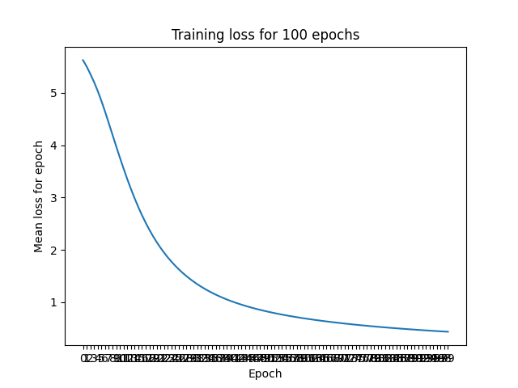

# Bonus question

Tl;dr: I have implemented a partially-working pipeline to extract text from the whole-page scans and classify it on a character-level with a trained model. The methodology to extract individual characters from pages in reading (top-to-bottom, left-to-right) order does not work very well and I decided it would be too much time to get working reliably.

Things left to do:
- Finish up code for reading characters etc 
- Decide how to assess performance in the absence of good matching method
- Write up:
    - Methodology
    - Example notebook showing performance of character extraction
    - Thoughts for further approaches

## Understanding the task

The dataset here is whole *pages* rather than individual characters. The task is now twofold:
- Extract individual words or characters from the pages
- Run OCR to convert those words/characters into readable form

## Overview of approach

My approach is as follows:
- Segment

## Detail of approach

### Extracting characters from each page

### Training a character-level model across all the data

I trained a model across *all* the 'trainig [sic]' data, using 90% of it for training and 10% for validation. Based on what I saw in my original experiments:
- 20 epochs was too few for the model to perform reasonably, so I trained this one for 100 epochs. 
- When training on a larger dataset that included many classes/styles/resolutions, the training loss jumped around a lot, suggesting the batch size was too small: so for this run I increased the batch size from 20 to 256. 

Training this model took almost exactly 8 hours using the gpu on `mltgpu`. The training log is available at `/home/gusandmich@GU.GU.SE/assignment_1_run_results/runs/bonus_task/results.log`.

The training dataset is very large - almost half a million items. Note I have not used a test dataset, only a validation set, so that I could maximize the available amount of training data. Testing would be done by evaluating performance on the downstream task i.e. how well it does at recognizing characters from the unseen page scans. 

| Section | Dataset size | 
| --- | --- | 
| Train | 439968 | 
| Validate | 49189 |

The performance is much better than we observed in the [original experiment](./main_assignment.md#train-on-all-thai-and-english-styles-jointly-200dpi-test-on-all-thai-and-english-styles-jointly), with 88%+ across all evaluation metrics. The train performance is a little better than the validation performance, so I suspect there's been some overfitting, but validation performance is still very good for a relatively simple architecture:

Metric | Train | Validation 
---|---|---
Precision | 88.599% | 88.376%
Recall | 88.775% | 88.499%
F1 | 88.576% | 88.328%
Accuracy | 88.934% | 88.717%

The trained model loss is also sensible. The loss no longer jumps around, so increasing the batch size was the right solution (no need to try a different optimizer). It looks like the loss has also settled down close to a minimum, so increasing to 100 epochs of training was also a good idea. In hindsight I probably should have plotted a valuation loss as well to stop overfitting (that is, stop training further once you see validation loss increasing and training loss decreasing):

(Sorry about the x-axis labelling! I should have labeled every 10 epochs. It goes from 0 to 99.)

## Roadmap for future work

### Summary of what I did and didn't do 

I have implemented code to do the following: 
- Load the images from the test set and segment them into the labelled 'zones'.
- Split each zone into text lines. 
    - I use OpenCV's morphologyEx to do this. It works reasonably well on pages that have *just* text, but works quite poorly on pages that have elements other than text (e.g. lines, diagrams).
- Extract characters from each zone using OpenCV's contour-finding functionality. 
    - I disregard contours that are too small.  
    - I tested my method manually in a Jupyter notebook and it seems to capture letters reasonably well. 
    - I added some vertical padding around each letter to correctly capture diacritics.
- Do a placeholder 'matching' between extracted characters and the provided labels (the end result is not very good, see below for more details). 
- Train a character-level model on all the provided training data.
- Use the character-level model to predict the correct label for each segment of text, compare this to the 'matched' label, and generate a final performance score. 

What I have not done: 
- Correctly match extracted characters to the labels. I decided getting this working was too much work and wasn't aligned with what I want to learn from the course, so didn't want to dedicate too much time to it. If I wanted to do this in practice I would just use an existing OCR tool that could handle it for me. If I wanted to implement something myself, I think there's two approaches here. One would be to fine-tune my existing method by playing with the parameters (kernel size etc) until it got reasonable performance on a wide range of pages. Another method I thought of would be:
    - Segment out the image into 'rows'. My idea for this is to reduce the image to a set of intensity peaks along the y-axis (you can do this with e.g. OpenCV's reduce method). Choose the top of each peak as the midpoint of the row. 
    - Run OpenCV's contours method and assign each character to the row it belongs to. I'd do this by taking the midpoint of each character's bounding box and assigning it to the closest row along the y-axis.
    - Sort the characters within each row left-to-right (since both Thai and English are read left-to-right) according to their x-coordinates. 
    - Finally, read all the characters left-to-right in row order and use this to match against the provided labels.   
- Use word-level (rather than character-level) methods to extract words. This would be a much larger project. My thinking here is: [...]

### Formatting
Last letter (b/g) indicates if b/w or grayscale. Dims are for grayscale only. Seems to work well enough for the bw too, though, from testing. 