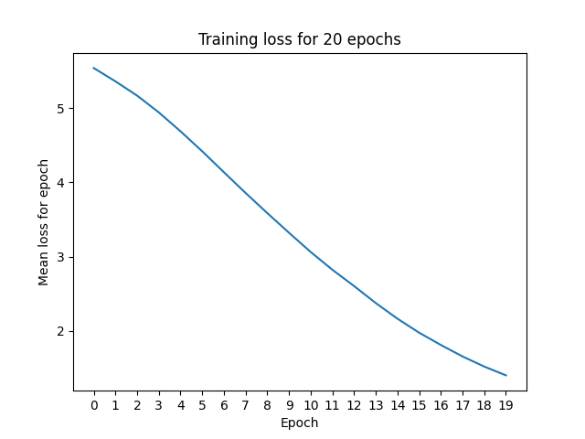
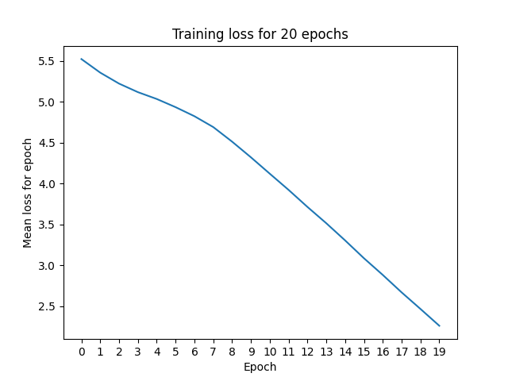
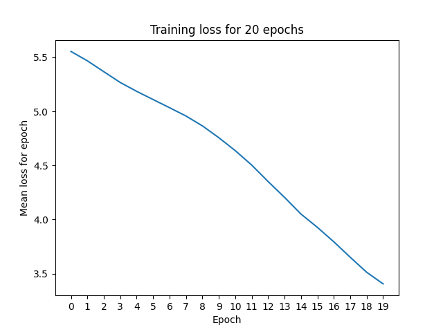

# Main assignment: writeup

## Comments on challenges / decisions
### Generating data
I generate the train/test/val datasets by writing a file in the format:

```
language,dpi,style,class_index,image_path
Thai,200,bold,199,/scratch/lt2326-2926-h24/ThaiOCR/ThaiOCR-TrainigSet/Thai/199/200/bold/KKTS212_200_31_20_199.bmp
```

This means the dataset definition uses up very little space and does not require copying any images around. 

### Image format
The provided images are in BMP, so we can't load them with PyTorch's [decode_image](https://pytorch.org/vision/main/generated/torchvision.io.decode_image.html#torchvision.io.decode_image) function (BMP is not one of the supported formats). Instead, I use PIL to load the image and then convert it to a tensor. 

All the images come in slightly different shapes, even in the same DPI, which makes training tricky because the model should (generally) expect to receive everything in the same input size. I dealt with this by [resizing all images](https://pytorch.org/vision/main/generated/torchvision.transforms.Resize.html), regardless of DPI, to 64x64 images. 

### Architecture
I chose to use [LeNet 5](https://yann.lecun.com/exdb/publis/pdf/lecun-01a.pdf) as the architecture for this task because I wanted an architecture I knew was performant for text recognition to eliminate architecture choices as a possible issue during debugging. 

The model outputs a vector that's equivalent in length to the number of classes: `output[i]` will get the probability of class `i`, where `i` is the numerical class assignment defined in any of the training dataset descriptions (e.g. at /scratch/lt2326-2926-h24/ThaiOCR/ThaiOCR-TrainigSet/English/20110202-List-Code-Character-OCR-Training-Database.txt). The most probable class can then by chosen by returning the highest-probability index.  

The output is *not* softmaxed - I'd initially applied a softmax but the PyTorch CrossEntropyLoss applies softmax as part of the loss, so doing so beforehand is unneeded. You could softmax the output of the model after it returns its predictions if you want to have a probability distribution on the output classes. 

## Experiment results

I ran all experiments with a batch size of 10 for 20 epochs. I chose these parameters arbitrarily. If I had more time I would have liked to do be more smart about this e.g. do some experiments to explore the impact of batch size on training performance, or include a smarter stopping criterion with an upper bound on the number of training epochs.

### Overview

The sections below summarize give train, test, and validation performance for each experiment; as well as showing training loss over time for the model.

My observations over all the experiments are as follows:
- The number of epochs I trained with (20) is too low. In all cases there is still lots of room for the training loss to reduce, as evidenced by the training loss graphs. 
- Performance is best when the train and test datasets come from the same distribution, as you would expect. 
- Performance is worst when you train on a distribution that covers a lot of styles / languages. However, the training loss does decrease over time, so I think with more training epochs the model would better learn these.
- Some of the model performances are supsiciously low for train/validation, making me think there was some sort of issue in the training: particularly, "Train on Thai normal text, 400dpi, test on Thai bold text, 400dpi" has about half the performance in train/validation that I would expect from other experiments, and similar for "Train on Thai bold text, test on Thai normal text". 
- Training on the overall dataset doesn't seem to return meaningful predictions at all - the train/validation/test results are all the same, which makes me think the model is just returning the same class for everything. The training loss jumps around a lot, which suggests to me that either I didn't shuffle the training data, I used a too small batch size, or I should consider a different optimizer. 


I realized after writing this section up that I hadn't shuffled the training data - there was a bug in my training data generation code and I hadn't set `shuffle=True` in the DataLoader. This will have affected model training. I fixed this before training my model for the bonus question. 


### Train on Thai normal text, 200dpi, test on Thai normal text, 200dpi

| Section | Dataset size | 
| --- | --- | 
| Train | 16220 | 
| Validate | 5356 |
| Test | 5654 | 

Metric | Train | Validation | Test |  
---|---|---|---|
Precision | 37.926% | 37.579% | 38.342% | 
Recall | 44.320% | 41.775% | 42.691% | 
F1 | 33.097% | 32.411% | 33.257% | 
Accuracy | 39.051% | 38.610% | 39.563% | 

Training loss:


### Train on Thai normal text, 400dpi, test on Thai normal text, 200dpi

| Section | Dataset size | 
| --- | --- | 
| Train | 21606 | 
| Validate | 5478 |
| Test | 27230 | 

Metric | Train | Validation | Test |  
---|---|---|---|
Precision | 32.696% | 32.068% | 29.360%
Recall | 34.865% | 33.611% | 32.801%
F1 | 26.000% | 25.506% | 22.793%
Accuracy | 33.741% | 33.060% | 30.213%

Training loss:



### Train on Thai normal text, 400dpi, test on Thai bold text, 400dpi

| Section | Dataset size | 
| --- | --- | 
| Train | 21606 | 
| Validate | 5478 |
| Test | 27145 | 

Metric | Train | Validation | Test |  
---|---|---|---|
Precision | 14.565% | 14.065% | 11.971%
Recall | 11.070% | 10.709% | 11.032%
F1 | 8.236% | 7.847%  | 6.962%
Accuracy | 15.176% | 14.640% | 12.441%

Training loss:




### Train on Thai bold text, test on Thai normal text

| Section | Dataset size | 
| --- | --- | 
| Train | 21752 | 
| Validate | 5513 |
| Test | 27230 | 

Metric | Train | Validation | Test |  
---|---|---|---|
Precision | 9.490% | 9.468% | 7.267%
Recall | 5.430% | 4.459% | 3.772%
F1 | 3.901% | 3.936% | 3.193%
Accuracy | 9.788% | 9.759% | 7.514%


Training loss:


### Train on all Thai styles, test on all Thai styles

| Section | Dataset size | 
| --- | --- | 
| Train | 64922 | 
| Validate | 22624 |
| Test | 21442 | 

Metric | Train | Validation | Test |  
---|---|---|---|
Precision | 2.674%  | 2.581% | 2.698% 
Recall | 0.200%  | 0.184% | 0.203% 
F1 | 0.355%  | 0.329% | 0.359% 
Accuracy | 2.786%  | 2.687% | 2.812% 

Training loss:


### Train on Thai and English normal text jointly, test on Thai and English normal text jointly

Metric | Train | Validation | Test |  
---|---|---|---|
Precision | 8.952% | 8.951% | 8.906% | 
Recall | 3.907% | 2.774% | 4.751% | 
F1 | 3.288% | 3.143% | 3.340% | 
Accuracy | 9.229% | 9.232% | 9.186% | 

Training loss:



### Train on all Thai and English styles jointly (200dpi), test on all Thai and English styles jointly

| Section | Dataset size | 
| --- | --- | 
| Train | 64922 | 
| Validate | 21442 |
| Test | 22624 | 

Metric | Train | Validation | Test |  
---|---|---|---|
Precision | 0.662% | 0.662% | 0.662%
Recall | 0.005% | 0.005% | 0.005%
F1 | 0.009% | 0.009% | 0.009%
Accuracy | 0.690% | 0.690% | 0.690%

Training loss:


